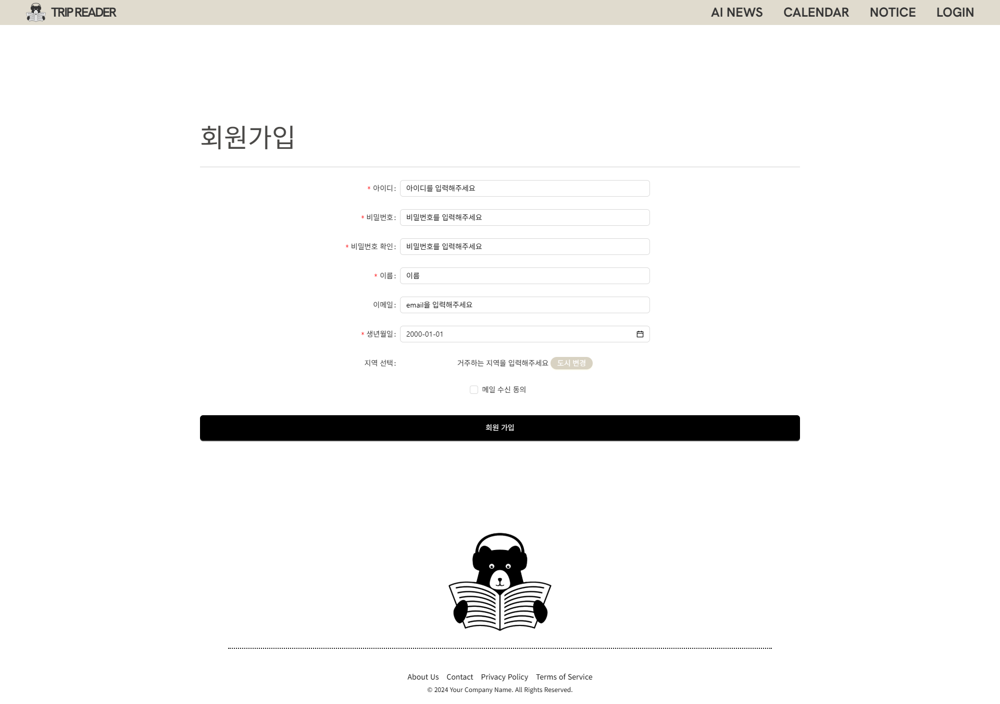

# TRIP-READER

- 프로젝트 기간 : 2024.11.02 - 2024.11.26
- 팀원 : @wavewwave20(박하민) @heo-hyunjun(허현준) 

 

## 프로젝트 소개
여행정보 요약 사이트로 공공데이터포털의 여행정보 api를 사용하여 여행정보를 수집하고 관련 기사를 chatGPT로 요약하여 제공합니다.

## 기술 스택
- 프론트엔드: vue.js
- 백엔드: Spring Boot
- DB: mySQL
- API 연동:
    - Tour API: 관광지 기본 정보 및 행사 데이터를 제공.
    - 카카오맵 API: 상세 지도 표시 및 위치 정보 제공.
    - 네이버 기사 API: 해당 관광지 관련 기사를 검색.
    - 유튜브 검색 API: 관광지 관련 비디오 검색.
    - ChatGPT API: 관광지 정보와 관련 기사를 제공하여 기사 요약을 생성.
- 회원 기능:
    - JWT 인증 방식을 통해 보안성 강화.

## 화면 구성

    
메인페이지

    

    
기사요약리스트

    

    
기사요약상세

    

    
행사정보리스트

    

    
행사정보상세

    

    
공지사항리스트

    

    
책갈피리스트

    

    
공지사항상세

    

    
로그인모달

    

    
로그인드랍다운

    

    
회원가입

    

    
비밀번호찾기

    

    
회원정보수정

    

