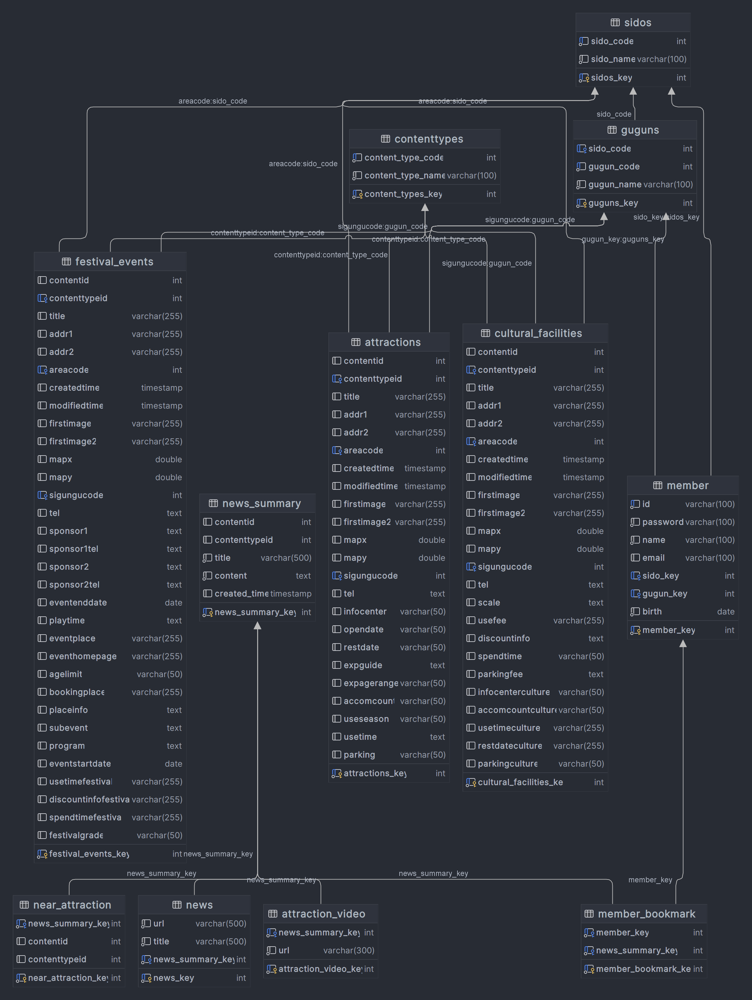
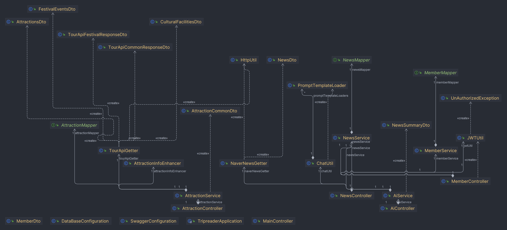
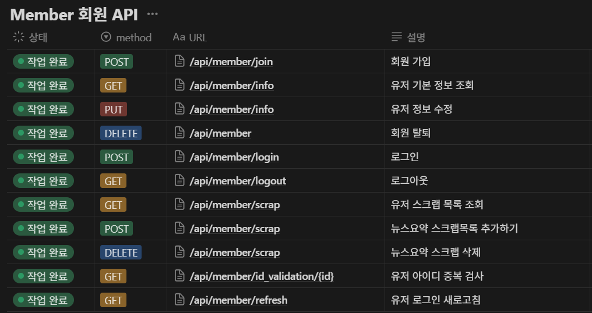
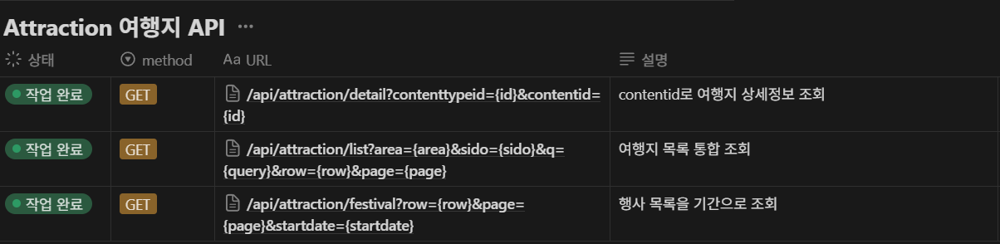

# Trip_Spring_Gwangju_04_박하민_허현준

## [Notion Link](https://eggplant-bed-903.notion.site/SSAFY-1-Project-130047f8e96580f58e2adb39e581fa04)

<details markdown="1">
<summary>SQL 접기/펼치기</summary>

``` sql
-- Drop schema 'trip_reader' if it exists and create a new one
DROP SCHEMA IF EXISTS trip_reader;
CREATE SCHEMA trip_reader;
USE trip_reader;

-- Table: sidos
CREATE TABLE sidos
(
    sidos_key INT AUTO_INCREMENT PRIMARY KEY,
    sido_code INT UNIQUE   NOT NULL,
    sido_name VARCHAR(100) NOT NULL
);

-- Table: guguns
CREATE TABLE guguns
(
    guguns_key INT AUTO_INCREMENT PRIMARY KEY,
    sido_code  int DEFAULT NULL,
    gugun_code INT          NOT NULL,
    gugun_name VARCHAR(100) NOT NULL,
    KEY `guguns_sido_to_sidos_cdoe_fk_idx` (`sido_code`),
    KEY `gugun_code_idx` (`gugun_code`),
    CONSTRAINT `guguns_sido_to_sidos_cdoe_fk` FOREIGN KEY (`sido_code`) REFERENCES `sidos` (`sido_code`)
);

-- Table: contenttypes
CREATE TABLE contenttypes
(
    content_types_key INT AUTO_INCREMENT PRIMARY KEY,
    content_type_code INT UNIQUE   NOT NULL,
    content_type_name VARCHAR(100) NOT NULL
);

-- Table: 관광지 (contenttypeid: 12)
CREATE TABLE attractions (
                             attractions_key INT AUTO_INCREMENT PRIMARY KEY,
                             contentid int,
                             contenttypeid INT,
                             title VARCHAR(255),
                             addr1 VARCHAR(255),
                             addr2 VARCHAR(255),
                             areacode int,
                             createdtime TIMESTAMP,
                             modifiedtime TIMESTAMP,
                             firstimage VARCHAR(255),
                             firstimage2 VARCHAR(255),
                             mapx DOUBLE PRECISION,
                             mapy DOUBLE PRECISION,
                             sigungucode int,
                             tel TEXT,
                             infocenter VARCHAR(50),
                             opendate VARCHAR(50),
                             restdate VARCHAR(50),
                             expguide TEXT,
                             expagerange VARCHAR(50),
                             accomcount VARCHAR(50),
                             useseason VARCHAR(50),
                             usetime TEXT,
                             parking VARCHAR(50),
                             FOREIGN KEY (contenttypeid) REFERENCES contenttypes (content_type_code),
                             FOREIGN KEY (areacode) REFERENCES sidos (sido_code),
                             FOREIGN KEY (sigungucode) REFERENCES guguns (gugun_code)
);

-- Table: 문화시설 (contenttypeid: 14)
CREATE TABLE cultural_facilities (
                                     cultural_facilities_key INT AUTO_INCREMENT PRIMARY KEY,
                                     contentid int,
                                     contenttypeid INT,
                                     title VARCHAR(255),
                                     addr1 VARCHAR(255),
                                     addr2 VARCHAR(255),
                                     areacode int,
                                     createdtime TIMESTAMP,
                                     modifiedtime TIMESTAMP,
                                     firstimage VARCHAR(255),
                                     firstimage2 VARCHAR(255),
                                     mapx DOUBLE PRECISION,
                                     mapy DOUBLE PRECISION,
                                     sigungucode int,
                                     tel TEXT,
                                     scale TEXT,
                                     usefee VARCHAR(255),
                                     discountinfo TEXT,
                                     spendtime VARCHAR(50),
                                     parkingfee TEXT,
                                     infocenterculture VARCHAR(50),
                                     accomcountculture VARCHAR(50),
                                     usetimeculture VARCHAR(255),
                                     restdateculture VARCHAR(255),
                                     parkingculture VARCHAR(50),
                                     FOREIGN KEY (contenttypeid) REFERENCES contenttypes (content_type_code),
                                     FOREIGN KEY (areacode) REFERENCES sidos (sido_code),
                                     FOREIGN KEY (sigungucode) REFERENCES guguns (gugun_code)
);

-- Table: 축제공연행사 (contenttypeid: 15)
CREATE TABLE festival_events (
                                 festival_events_key INT AUTO_INCREMENT PRIMARY KEY,
                                 contentid int,
                                 contenttypeid INT,
                                 title VARCHAR(255),
                                 addr1 VARCHAR(255),
                                 addr2 VARCHAR(255),
                                 areacode int,
                                 createdtime TIMESTAMP,
                                 modifiedtime TIMESTAMP,
                                 firstimage VARCHAR(255),
                                 firstimage2 VARCHAR(255),
                                 mapx DOUBLE PRECISION,
                                 mapy DOUBLE PRECISION,
                                 sigungucode int,
                                 tel TEXT,
                                 sponsor1 TEXT,
                                 sponsor1tel TEXT,
                                 sponsor2 TEXT,
                                 sponsor2tel TEXT,
                                 eventenddate DATE,
                                 playtime TEXT,
                                 eventplace VARCHAR(255),
                                 eventhomepage VARCHAR(255),
                                 agelimit VARCHAR(50),
                                 bookingplace VARCHAR(255),
                                 placeinfo TEXT,
                                 subevent TEXT,
                                 program TEXT,
                                 eventstartdate DATE,
                                 usetimefestival VARCHAR(255),
                                 discountinfofestival VARCHAR(255),
                                 spendtimefestival VARCHAR(255),
                                 festivalgrade VARCHAR(50),
                                 FOREIGN KEY (contenttypeid) REFERENCES contenttypes (content_type_code),
                                 FOREIGN KEY (areacode) REFERENCES sidos (sido_code),
                                 FOREIGN KEY (sigungucode) REFERENCES guguns (gugun_code)
);

-- Table: news_summary
CREATE TABLE news_summary
(
    news_summary_key INT AUTO_INCREMENT PRIMARY KEY,
    contentid int,
    contenttypeid INT,
    title            VARCHAR(500) NOT NULL,
    content          TEXT         NOT NULL,
    created_time     TIMESTAMP DEFAULT CURRENT_TIMESTAMP
);

-- Table: near_attraction
CREATE TABLE near_attraction
(
    near_attraction_key INT AUTO_INCREMENT PRIMARY KEY,
    news_summary_key    INT NOT NULL,
    contentid int,
    contenttypeid INT,
    FOREIGN KEY (news_summary_key) REFERENCES news_summary (news_summary_key)
);

-- Table: attraction_video
CREATE TABLE attraction_video
(
    attraction_video_key INT AUTO_INCREMENT PRIMARY KEY,
    news_summary_key     INT          NOT NULL,
    url                  VARCHAR(300) NOT NULL,
    FOREIGN KEY (news_summary_key) REFERENCES news_summary (news_summary_key)
);

-- Table: news
CREATE TABLE news
(
    news_key         INT AUTO_INCREMENT PRIMARY KEY,
    url              VARCHAR(500) NOT NULL,
    title            VARCHAR(500) NOT NULL,
    news_summary_key INT          NOT NULL,
    FOREIGN KEY (news_summary_key) REFERENCES news_summary (news_summary_key)
);

-- Table: member
CREATE TABLE member
(
    member_key INT AUTO_INCREMENT PRIMARY KEY,
    id         VARCHAR(100) UNIQUE NOT NULL,
    password   VARCHAR(100)        NOT NULL,
    name       VARCHAR(100)        NOT NULL,
    email      VARCHAR(100)        NULL DEFAULT '',
    sido_key   INT,
    gugun_key  INT,
    birth      DATE                NOT NULL,
    FOREIGN KEY (sido_key) REFERENCES sidos (sidos_key),
    FOREIGN KEY (gugun_key) REFERENCES guguns (guguns_key)
);

-- Table: member_bookmark
CREATE TABLE member_bookmark
(
    member_bookmark_key INT AUTO_INCREMENT PRIMARY KEY,
    member_key          INT NOT NULL,
    news_summary_key    INT NOT NULL,
    FOREIGN KEY (member_key) REFERENCES member (member_key),
    FOREIGN KEY (news_summary_key) REFERENCES news_summary (news_summary_key)
);

INSERT INTO `contenttypes`(content_type_code, content_type_name)
VALUES (12, '관광지'),
       (14, '문화시설'),
       (15, '축제공연행사'),
       (25, '여행코스'),
       (28, '레포츠'),
       (32, '숙박'),
       (38, '쇼핑'),
       (39, '음식점');
INSERT INTO `sidos`
VALUES (1, 1, '서울'),
       (2, 2, '인천'),
       (3, 3, '대전'),
       (4, 4, '대구'),
       (5, 5, '광주'),
       (6, 6, '부산'),
       (7, 7, '울산'),
       (8, 8, '세종특별자치시'),
       (9, 31, '경기도'),
       (10, 32, '강원특별자치도'),
       (11, 33, '충청북도'),
       (12, 34, '충청남도'),
       (13, 35, '경상북도'),
       (14, 36, '경상남도'),
       (15, 37, '전북특별자치도'),
       (16, 38, '전라남도'),
       (17, 39, '제주도');
INSERT INTO `guguns`
VALUES (1, 1, 1, '강남구'),
       (2, 1, 2, '강동구'),
       (3, 1, 3, '강북구'),
       (4, 1, 4, '강서구'),
       (5, 1, 5, '관악구'),
       (6, 1, 6, '광진구'),
       (7, 1, 7, '구로구'),
       (8, 1, 8, '금천구'),
       (9, 1, 9, '노원구'),
       (10, 1, 10, '도봉구'),
       (11, 1, 11, '동대문구'),
       (12, 1, 12, '동작구'),
       (13, 1, 13, '마포구'),
       (14, 1, 14, '서대문구'),
       (15, 1, 15, '서초구'),
       (16, 1, 16, '성동구'),
       (17, 1, 17, '성북구'),
       (18, 1, 18, '송파구'),
       (19, 1, 19, '양천구'),
       (20, 1, 20, '영등포구'),
       (21, 1, 21, '용산구'),
       (22, 1, 22, '은평구'),
       (23, 1, 23, '종로구'),
       (24, 1, 24, '중구'),
       (25, 1, 25, '중랑구'),
       (26, 2, 1, '강화군'),
       (27, 2, 2, '계양구'),
       (28, 2, 3, '미추홀구'),
       (29, 2, 4, '남동구'),
       (30, 2, 5, '동구'),
       (31, 2, 6, '부평구'),
       (32, 2, 7, '서구'),
       (33, 2, 8, '연수구'),
       (34, 2, 9, '옹진군'),
       (35, 2, 10, '중구'),
       (36, 3, 1, '대덕구'),
       (37, 3, 2, '동구'),
       (38, 3, 3, '서구'),
       (39, 3, 4, '유성구'),
       (40, 3, 5, '중구'),
       (41, 4, 1, '남구'),
       (42, 4, 2, '달서구'),
       (43, 4, 3, '달성군'),
       (44, 4, 4, '동구'),
       (45, 4, 5, '북구'),
       (46, 4, 6, '서구'),
       (47, 4, 7, '수성구'),
       (48, 4, 8, '중구'),
       (49, 4, 9, '군위군'),
       (50, 5, 1, '광산구'),
       (51, 5, 2, '남구'),
       (52, 5, 3, '동구'),
       (53, 5, 4, '북구'),
       (54, 5, 5, '서구'),
       (55, 6, 1, '강서구'),
       (56, 6, 2, '금정구'),
       (57, 6, 3, '기장군'),
       (58, 6, 4, '남구'),
       (59, 6, 5, '동구'),
       (60, 6, 6, '동래구'),
       (61, 6, 7, '부산진구'),
       (62, 6, 8, '북구'),
       (63, 6, 9, '사상구'),
       (64, 6, 10, '사하구'),
       (65, 6, 11, '서구'),
       (66, 6, 12, '수영구'),
       (67, 6, 13, '연제구'),
       (68, 6, 14, '영도구'),
       (69, 6, 15, '중구'),
       (70, 6, 16, '해운대구'),
       (71, 7, 1, '중구'),
       (72, 7, 2, '남구'),
       (73, 7, 3, '동구'),
       (74, 7, 4, '북구'),
       (75, 7, 5, '울주군'),
       (76, 8, 1, '세종특별자치시'),
       (77, 31, 1, '가평군'),
       (78, 31, 2, '고양시'),
       (79, 31, 3, '과천시'),
       (80, 31, 4, '광명시'),
       (81, 31, 5, '광주시'),
       (82, 31, 6, '구리시'),
       (83, 31, 7, '군포시'),
       (84, 31, 8, '김포시'),
       (85, 31, 9, '남양주시'),
       (86, 31, 10, '동두천시'),
       (87, 31, 11, '부천시'),
       (88, 31, 12, '성남시'),
       (89, 31, 13, '수원시'),
       (90, 31, 14, '시흥시'),
       (91, 31, 15, '안산시'),
       (92, 31, 16, '안성시'),
       (93, 31, 17, '안양시'),
       (94, 31, 18, '양주시'),
       (95, 31, 19, '양평군'),
       (96, 31, 20, '여주시'),
       (97, 31, 21, '연천군'),
       (98, 31, 22, '오산시'),
       (99, 31, 23, '용인시'),
       (100, 31, 24, '의왕시'),
       (101, 31, 25, '의정부시'),
       (102, 31, 26, '이천시'),
       (103, 31, 27, '파주시'),
       (104, 31, 28, '평택시'),
       (105, 31, 29, '포천시'),
       (106, 31, 30, '하남시'),
       (107, 31, 31, '화성시'),
       (108, 32, 1, '강릉시'),
       (109, 32, 2, '고성군'),
       (110, 32, 3, '동해시'),
       (111, 32, 4, '삼척시'),
       (112, 32, 5, '속초시'),
       (113, 32, 6, '양구군'),
       (114, 32, 7, '양양군'),
       (115, 32, 8, '영월군'),
       (116, 32, 9, '원주시'),
       (117, 32, 10, '인제군'),
       (118, 32, 11, '정선군'),
       (119, 32, 12, '철원군'),
       (120, 32, 13, '춘천시'),
       (121, 32, 14, '태백시'),
       (122, 32, 15, '평창군'),
       (123, 32, 16, '홍천군'),
       (124, 32, 17, '화천군'),
       (125, 32, 18, '횡성군'),
       (126, 33, 1, '괴산군'),
       (127, 33, 2, '단양군'),
       (128, 33, 3, '보은군'),
       (129, 33, 4, '영동군'),
       (130, 33, 5, '옥천군'),
       (131, 33, 6, '음성군'),
       (132, 33, 7, '제천시'),
       (133, 33, 8, '진천군'),
       (134, 33, 9, '청원군'),
       (135, 33, 10, '청주시'),
       (136, 33, 11, '충주시'),
       (137, 33, 12, '증평군'),
       (138, 34, 1, '공주시'),
       (139, 34, 2, '금산군'),
       (140, 34, 3, '논산시'),
       (141, 34, 4, '당진시'),
       (142, 34, 5, '보령시'),
       (143, 34, 6, '부여군'),
       (144, 34, 7, '서산시'),
       (145, 34, 8, '서천군'),
       (146, 34, 9, '아산시'),
       (147, 34, 11, '예산군'),
       (148, 34, 12, '천안시'),
       (149, 34, 13, '청양군'),
       (150, 34, 14, '태안군'),
       (151, 34, 15, '홍성군'),
       (152, 34, 16, '계룡시'),
       (153, 35, 1, '경산시'),
       (154, 35, 2, '경주시'),
       (155, 35, 3, '고령군'),
       (156, 35, 4, '구미시'),
       (157, 35, 6, '김천시'),
       (158, 35, 7, '문경시'),
       (159, 35, 8, '봉화군'),
       (160, 35, 9, '상주시'),
       (161, 35, 10, '성주군'),
       (162, 35, 11, '안동시'),
       (163, 35, 12, '영덕군'),
       (164, 35, 13, '영양군'),
       (165, 35, 14, '영주시'),
       (166, 35, 15, '영천시'),
       (167, 35, 16, '예천군'),
       (168, 35, 17, '울릉군'),
       (169, 35, 18, '울진군'),
       (170, 35, 19, '의성군'),
       (171, 35, 20, '청도군'),
       (172, 35, 21, '청송군'),
       (173, 35, 22, '칠곡군'),
       (174, 35, 23, '포항시'),
       (175, 36, 1, '거제시'),
       (176, 36, 2, '거창군'),
       (177, 36, 3, '고성군'),
       (178, 36, 4, '김해시'),
       (179, 36, 5, '남해군'),
       (180, 36, 6, '마산시'),
       (181, 36, 7, '밀양시'),
       (182, 36, 8, '사천시'),
       (183, 36, 9, '산청군'),
       (184, 36, 10, '양산시'),
       (185, 36, 12, '의령군'),
       (186, 36, 13, '진주시'),
       (187, 36, 14, '진해시'),
       (188, 36, 15, '창녕군'),
       (189, 36, 16, '창원시'),
       (190, 36, 17, '통영시'),
       (191, 36, 18, '하동군'),
       (192, 36, 19, '함안군'),
       (193, 36, 20, '함양군'),
       (194, 36, 21, '합천군'),
       (195, 37, 1, '고창군'),
       (196, 37, 2, '군산시'),
       (197, 37, 3, '김제시'),
       (198, 37, 4, '남원시'),
       (199, 37, 5, '무주군'),
       (200, 37, 6, '부안군'),
       (201, 37, 7, '순창군'),
       (202, 37, 8, '완주군'),
       (203, 37, 9, '익산시'),
       (204, 37, 10, '임실군'),
       (205, 37, 11, '장수군'),
       (206, 37, 12, '전주시'),
       (207, 37, 13, '정읍시'),
       (208, 37, 14, '진안군'),
       (209, 38, 1, '강진군'),
       (210, 38, 2, '고흥군'),
       (211, 38, 3, '곡성군'),
       (212, 38, 4, '광양시'),
       (213, 38, 5, '구례군'),
       (214, 38, 6, '나주시'),
       (215, 38, 7, '담양군'),
       (216, 38, 8, '목포시'),
       (217, 38, 9, '무안군'),
       (218, 38, 10, '보성군'),
       (219, 38, 11, '순천시'),
       (220, 38, 12, '신안군'),
       (221, 38, 13, '여수시'),
       (222, 38, 16, '영광군'),
       (223, 38, 17, '영암군'),
       (224, 38, 18, '완도군'),
       (225, 38, 19, '장성군'),
       (226, 38, 20, '장흥군'),
       (227, 38, 21, '진도군'),
       (228, 38, 22, '함평군'),
       (229, 38, 23, '해남군'),
       (230, 38, 24, '화순군'),
       (231, 39, 1, '남제주군'),
       (232, 39, 2, '북제주군'),
       (233, 39, 3, '서귀포시'),
       (234, 39, 4, '제주시');
```

</details>

## 데이터베이스 다이어그램


## 클래스 다이어그램


## 회원 api


## 뉴스 api


## 여행지 api



